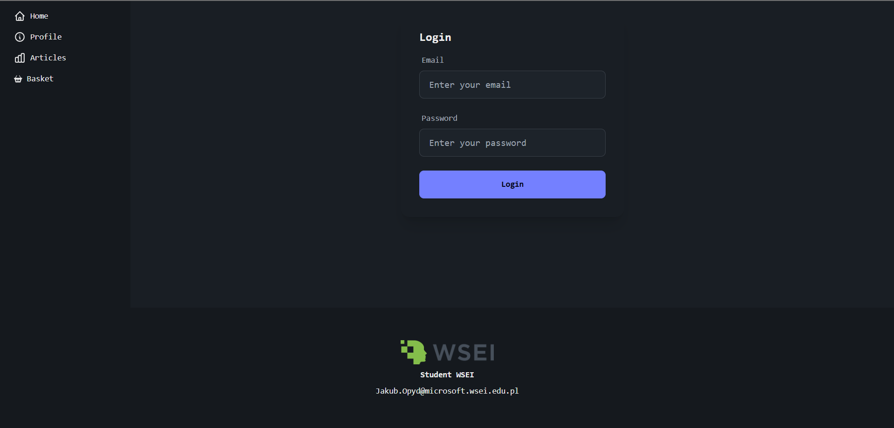
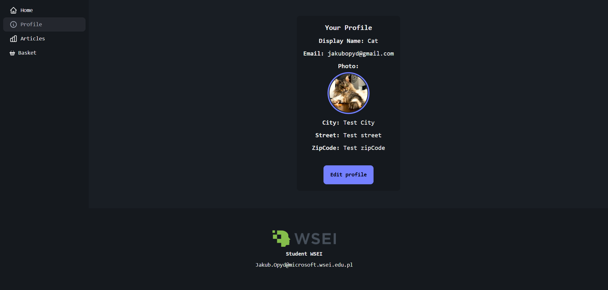
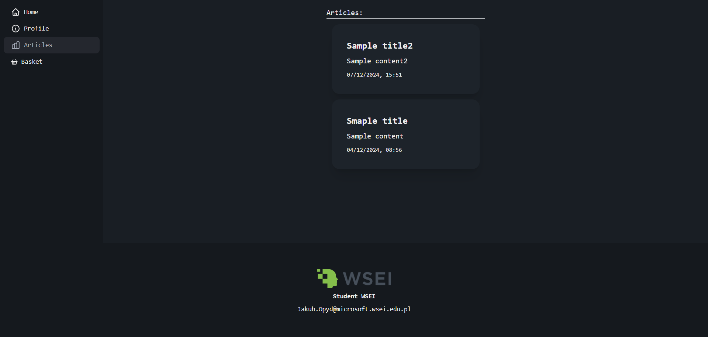
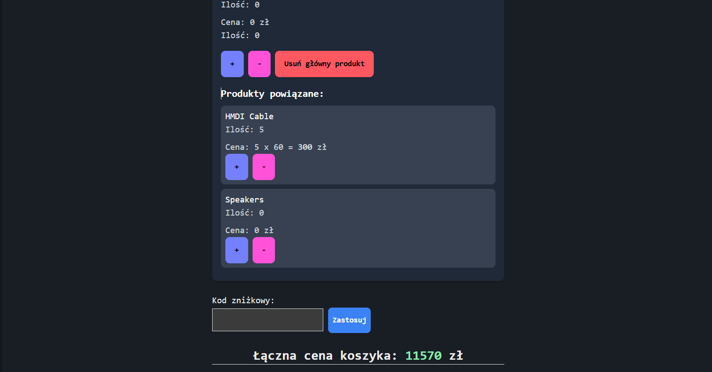

# Firebase E-Commerce Cart

A student project created as part of the **Front-end frameworks** course, presenting a functional e-commerce shopping cart integrated with Firebase.
The application allows user authentication, cart management, and promotional code handling.

👉 [Live Demo](https://firebase-nextjs-jo.vercel.app/user/profile)

---

## ✨ Features

- **Authentication & user data** – login with Firebase Authentication.
- **Shopping cart** 
  - clear the cart,
  - change product quantity,
  - display related product suggestions (e.g., mouse, bag, warranty),
  - automatic removal of related items when the main product is removed,
  - cart cost summary,
  - support for a promo code (`DISCOUNT10` – 10% discount).

---

## 🛠 Tech Stack & Architecture

- **Framework**: [Next.js](https://nextjs.org/) (App Router – `app/` directory)
- **Styling**:
  - [Tailwind CSS](https://tailwindcss.com/)
  - [DaisyUI](https://daisyui.com/)
- **Forms**: [react-hook-form](https://react-hook-form.com/)
- **Icons**: [react-icons](https://react-icons.github.io/react-icons/)
- **E2E Testing**: [Playwright](https://playwright.dev/) – login and profile validation tests
- **Firebase**:
  - Authentication (user login)
  - Firestore (cart items and user data storage)

### Project structure

```
/app – main views and logic (Next.js)
/public– static assets (images, favicon)
/tests – E2E tests (Playwright)
```

---

## 🚀 Getting started locally

1. Clone the repository:
   ```bash
   git clone https://github.com/JakubOpydwsei/Firebase.git
   cd Firebase
   ```
2. Install dependencies:
   ```bash
   npm install
   ```
3. Create a `.env` file with Firebase configuration (see `.env.example`).
4. Run the development server:
   ```bash
   npm run dev
   ```

---

## 👤 Test accounts

- **Login**: `jakubopyd@gmail.com` / **Password**: `zaq12wsx`
- **Login**: `kubaopyd@interia.pl` / **Password**: `zaq12wsx`

---

## ✅ Tests

The project includes 2 E2E tests:

- successful login validation,
- correct user profile display.

Tests are run using Playwright.

---

## 📸 Screenshots






---

## 🔮 Development

This project was created as part of coursework – no further development is currently planned.